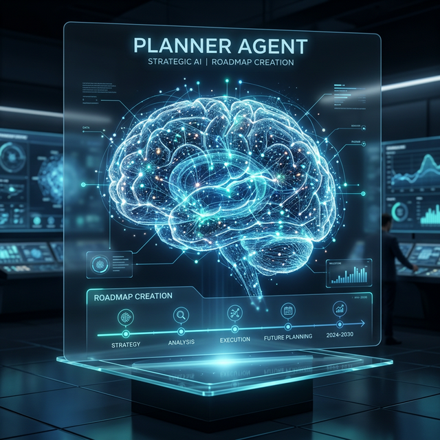
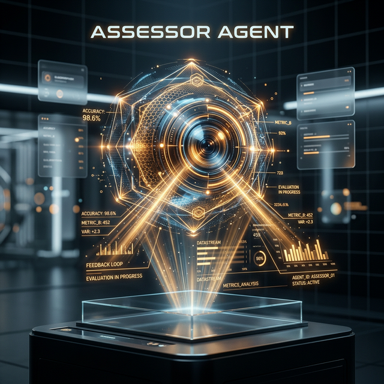
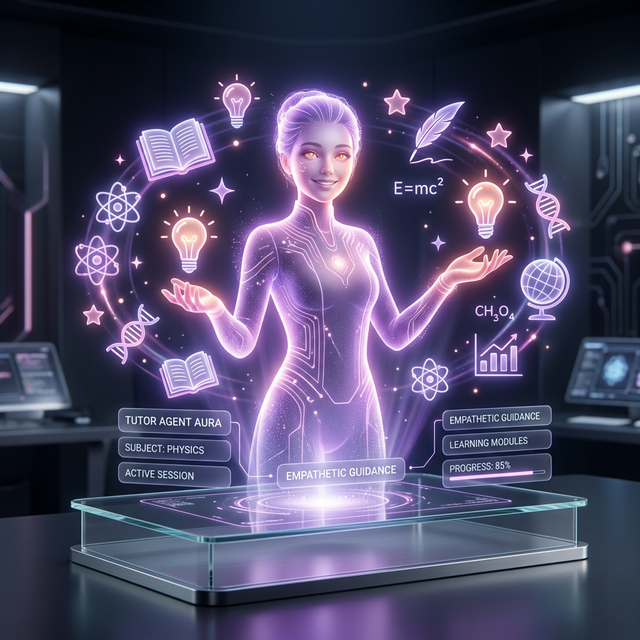
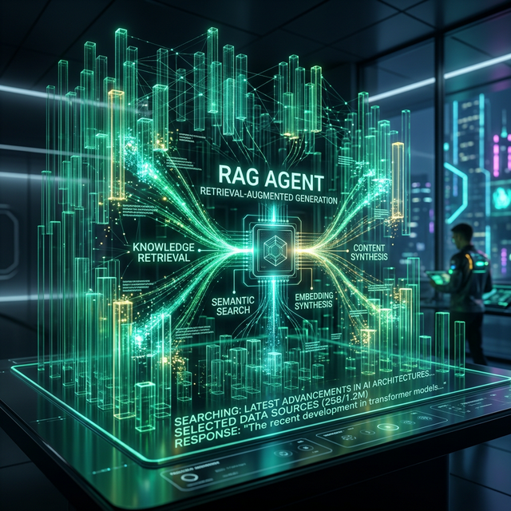
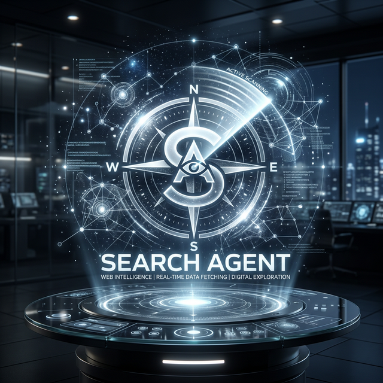
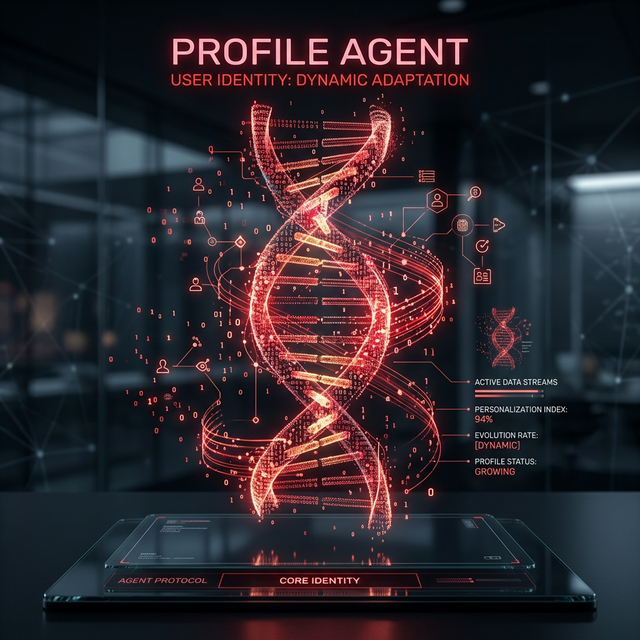

# Aion Tutor: The Personalized Multi-Agent Learning Suite

Aion Tutor is a state-of-the-art, self-paced learning platform powered by a sophisticated multi-agent system implemented using the **Native ADK (Agent Development Kit)**. It adapts dynamically to individual learning styles, certifications, and goals to provide a truly personalized educational experience.

## 🤖 The Agent Fleet

Our architecture leverages a specialized fleet of AI agents, each optimized for specific dimensions of the learning journey.

| Agent | Visual | Description |
| :--- | :---: | :--- |
| **Planner** |  | Architect of the learning roadmap. Analyzes user goals and breaks them into achievable milestones. |
| **Assessor** |  | Provides real-time evaluation and feedback. Monitors progress and ensures mastery of concepts. |
| **Tutor** |  | The primary interface for learning. Uses empathetic guidance to explain complex topics. |
| **RAG Agent** |  | Harnesses vast knowledge bases. Retrieves and synthesizes information using advanced vector search. |
| **Search Agent** |  | Your window to the web. Performs deep research and fetches real-time data for up-to-date learning. |
| **Profile Agent** |  | The keeper of identity. Continuously adapts the system to the user's evolving knowledge and preferences. |

## 🚀 Key Features

- **Personalized Onboarding:** Tailors the entire experience based on your background, certifications, and learning objectives.
- **Unified Multi-Agent System:** Orchestrated agents work in harmony to provide a seamless learning flow.
- **Real-time Synchronization:** Powered by Supabase for instant data persistence and real-time updates.
- **Modern Tech Stack:** Built with Next.js (Frontend), FastAPI/ADK (Backend), and Google Gemini (AI Models).

## 🛠 Tech Stack

- **Large Language Models:** Google Gemini 3.0 Pro & Flash
- **Frameworks:** Native ADK, FastAPI, Next.js 14, React
- **Database / Auth:** Supabase (PostgreSQL, Realtime, Auth)
- **Styling:** Vanilla CSS / Tailwind (Modern UI/UX)

## 📦 Getting Started

### Backend Setup
1. Navigate to `backend/`
2. Install dependencies: `uv sync`
3. Configure `.env` with your Google Cloud and Supabase keys.
4. Run the suite: `bash run_all.sh`

### Frontend Setup
1. Navigate to `frontend/`
2. Install dependencies: `npm install`
3. Configure `.env.local`
4. Start the dev server: `npm run dev`

---
*Created by OMIXEC - Pioneering the future of AI-driven education.*
